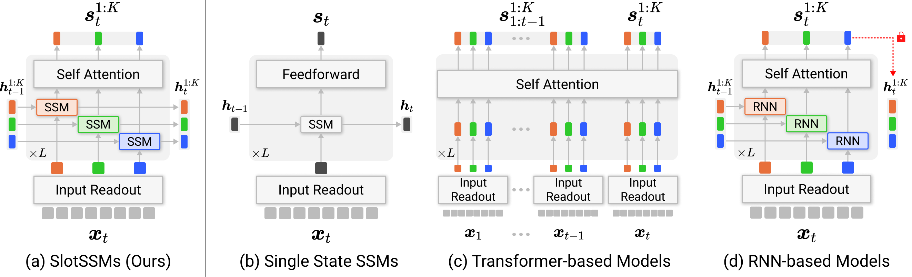
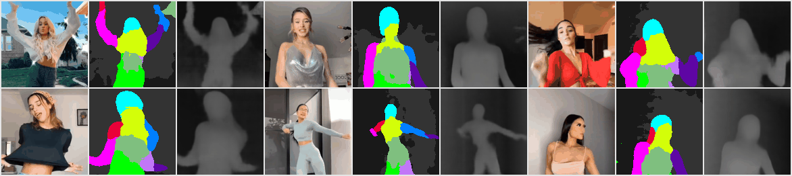
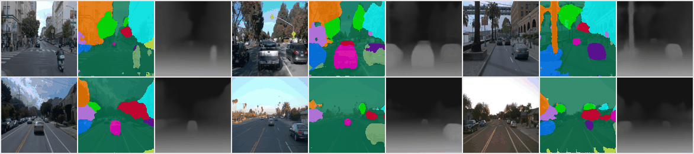
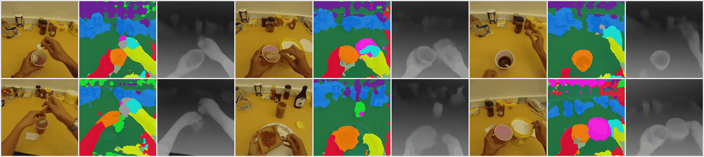

# SlotSSMs: Slot State Space Models
This is the official PyTorch implementation of **SlotSSMs** presented in the paper:

> [Slot State Space Models](https://arxiv.org/abs/2406.12272)   
> *[Jindong Jiang](https://jindongjiang.me/), [Fei Deng](https://scholar.google.com/citations?hl=en&user=F-V72fUAAAAJ&view_op=list_works&sortby=pubdate), [Gautam Singh](https://singhgautam.github.io/), [Minseung Lee](https://mlml.kaist.ac.kr/9b335270-f27b-477b-85ea-0bcaacdbc539), [Sungjin Ahn](https://mlml.kaist.ac.kr/sungjinahn)*   
> 🌟 **NeurIPS 2024** 🌟  
> [Project page](https://slotssms.github.io/): https://slotssms.github.io/    
> [NeurIPS Submission](https://openreview.net/forum?id=BJv1t4XNJW): https://openreview.net/forum?id=BJv1t4XNJW

<!-- ## Updates
* **2024.11.25:** Added implementation of SlotSSMs with Mamba 1 and Mamba 2 support. -->

## Highlights

SlotSSMs propose an efficient and powerful framework for video understanding by incorporating independent mechanisms into State Space Models (SSMs), such as [Mamba](https://arxiv.org/abs/2312.00752), to encourage separation of information for each entity in a scene, thereby improving visual reasoning. Unlike conventional SSMs that maintain a monolithic state vector, SlotSSMs maintain a set of modular states whose **dynamics are designed to be independent in time**, with **interactions modeled through self-attention in space**.

By adopting SSMs at its core, SlotSSMs inherit their strengths: parallelizable training, memory efficiency, and long-range reasoning capabilities, giving it an advantage over methods based on RNNs and Transformers.


<p align="center">
  
  <p style="font-size: 16pt; margin-top: 0px;">
    <strong>SlotSSMs vs existing models.</strong> (a) SlotSSMs incorporate modularity through independent state transitions and sparse interactions via self-attention. (b) Traditional SSMs utilize a monolithic state vector for all past information. (c) Multi-slot Transformer-based models offer modularity but with high computational complexity. (d) Multi-slot RNN-based models have modular states but can't parallelize training (red lock). SlotSSMs combine parallelizable training, memory efficiency, and modularity for efficient temporal modeling.
  </p>
</p>


In our experiments, we evaluate SlotSSMs in long-context video understanding, video prediction, object-centric learning, 3D visual reasoning, and more. Below, we show qualitative results of the depth prediction task to showcase the **emerging modularity** in SlotSSMs for real-world video inputs.
<!-- This demonstrates that SlotSSM is able to utilize the modular representations to discover and exploit the latent structure of the input to complete the task, while the SAVi++ baseline does not demonstrate the same level of emergent modularity. -->

<div align="center">
  
  <p style="font-size: 18px; margin-bottom: 5px;">TikTok Dataset</p>
  
  <p style="font-size: 18px; margin-bottom: 5px;">Waymo Dataset</p>
  
  <p style="font-size: 18px; margin-bottom: 5px;">UT Egocentric Dataset</p>
  <p style="font-size: 16pt; margin-top: 0px;">
    <strong>Emergent Scene Decomposition from Depth Estimation Tasks.</strong> Colors represent the ID of slots used for predicting each position.
    SlotSSM is capable of exploiting the inherent modular structure of real-world videos for efficient inference, without explicit segmentation supervision.
  </p>
</div>

## Repository Overview

This repository is a re-implementation of SlotSSMs with supports for Mamba 1 and Mamba 2 in temporal modeling and FlashAttention in spatial attention. To facilitate model saving and loading, we base the model implementation on Hugging Face’s [PreTrainedModel](https://huggingface.co/docs/transformers/en/main_classes/model#transformers.PreTrainedModel) class and model configuration on [PretrainedConfig](https://huggingface.co/docs/transformers/en/main_classes/configuration#transformers.PretrainedConfig). We use Hugging Face's [Accelerate](https://huggingface.co/docs/accelerate/index) library to manage distributed and mixed precision training.

The project structure is shown below:

* `train.py`: An example of model training using the [CLEVRER](http://clevrer.csail.mit.edu/) dataset on a reconstruction task.
* `src`: Source code
    * `data`: Data loading utilities
    * `models`: Core model definitions
        * `encoder.py`: Image encoder, we provide ViT-based and CNN-based encoder
        * `slotssm.py`: SlotSSM model definition
        * `decoder.py`: Image decoder, we provide ViT-based and CNN-based decoder
        * `modules.py`: Eager implementation of MultiHeadAttention (MHA) and Inverted MHA
    * `utils`: Utility functions
* `scripts`: Helper scripts
    * `environment.sh`: Environment setup

## Setup and Usage

### Dependencies

Setup your environment with our provided script in `scripts/environment.sh`. It includes the following steps:

Create and activate a conda environment (Python 3.10 is used here):
```bash
conda create -n "slotssm" python=3.10 -y 
conda activate slotssm
```

Install pip toolkit and PyTorch library (select the CUDA version compatible with your system):
```bash
conda install pip -y
pip install --upgrade pip
conda install -c nvidia cuda-toolkit -y
pip install torch torchvision torchaudio
```

(Optional) Install FlashAttention:
```bash
pip install flash-attn --no-build-isolation
```

Install Mamba dependencies:
```bash
pip install git+https://github.com/Dao-AILab/causal-conv1d
pip install git+https://github.com/state-spaces/mamba
```

Other packages are installed using the following command.
```bash
pip install transformer accelerate decord
```

### Preparing Data

We use the CLEVRER dataset as an example. Download the dataset from the [official website](http://clevrer.csail.mit.edu/) and unzip it.

```bash
mkdir -p data/clevrer/videos/train/ && \
cd data/clevrer/videos/train/ && \
wget http://data.csail.mit.edu/clevrer/videos/train/video_train.zip && \
unzip video_train.zip
```

### Training 

After setting up the environment and preparing the data, you can train the model using `train.py`. We provide an example of representation learning on the CLEVRER dataset through video reconstruction.

For systems with limited GPU memory, adjust the `gradient_accumulation_steps` and `batch_size`. The actually batch size would be `gradient_accumulation_steps x num_processes x batch_size`. You may also use mixed precision training to save memory.

```bash
CUDA_VISIBLE_DEVICES=0,1,2,3 accelerate launch --multi_gpu --num_processes=4 --main_process_port 29500 train.py \
--seq_len 16 --train_data_path /path/to/your/dataset --mixed_precision fp16
```

## Citation

If you find this code useful for your research, please cite our paper with the following BibTeX entry

```
@article{jiang2024slot,
  title={Slot State Space Models},
  author={Jiang, Jindong and Deng, Fei and Singh, Gautam and Lee, Minseung and Ahn, Sungjin},
  journal={NeurIPS},
  year={2024}
}
```
